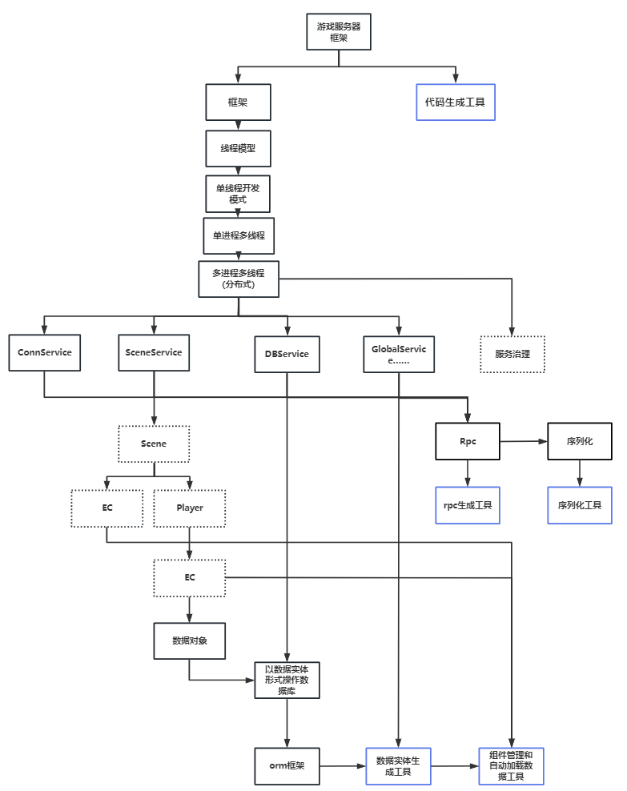

# EverydayNess
思路推演图

# 特点
* 分布式：rpc快速实现进程和线程间通信
* 无锁：除线程间通信的队列使用CAS外，其他位置都无锁
* 无阻塞：除必要的阻塞，例如启服配置加载、DBService有IO操作外，运行时均无阻塞
* 无反射：只在进程启动初始化时有少量的反射，运行时
* 无SQL：操作数据实体即操作数据库
* 模块化Service：以Service为单位进行开发，逻辑中无需关系其他Service在哪个进程哪个线程，部署时确定Service在哪个进程哪个线程，使新开发一个Service成为一件底层本的事。
* Generator工具：生成逻辑层与框架层之间的代码，使逻辑调用底层（rpc、序列化、orm……）更简单，提高开发效率，减少bug概率
* Be explicitly：代码明确可见，因为无反射、生成代码为明文、不存在注入 代码增强……等，所以阅读代码可以连贯从头看到尾，学习成本低
* 依赖少：少量使用成熟第三方库（Netty、Log、Protobuf……），进一步降低学习成本

# 实现
## RPC（完成）
实现Service间异步通信，无视在哪个进程或线程  

异步调用无非两个步骤，调度和回调，调度决定rpc发送到哪个线程、进程，回调决定rpc返回时回到原线程。  

因为使用C#开发，C#的协程（async、await、Task）实现了一个异步调用的语法糖，而非真正的线程，控制C#协程调度和回调的分别为一下两个类
* TaskScheduler：可以自定义TaskScheduler实现调度器，负责调度rpc发送到哪个线程或哪个进程，线程间直接投递到目标线程的消息队列，进程间先通过tcp发送，到达目标进程后再投递到目标线程的消息队列
* SynchronizationContext：可以自定义SynchronizationContext实现回调，负责把rpc返回的结果交给原线程处理
  （应该有更好的方式，不需要SynchronizationContext）

## ORM（未开始）
实现自动化标脏、增量、落地的orm框架，逻辑层只关心和操作数据实体，无需关心sql和如何落地。  
主要由以下两部分组成：  
* DBService：负责缓存和合并待落地的Data，可定时落地、也可强刷
* 数据实体类：处于开发者和DBService之间，以数据实体的形式提供CRUD，底层实际调用rpc发送给DBService。本质上是把DBService提供的rpc接口封装在数据实体中，玩家操作数据实体即操作了DBService，即操作了数据库

    只实现数据实体自动同步给DBService rpc接口，具体DBService的缓存策略和数据库的选择由使用者决定  

## 通信（开始）
接入netty，kcp

    不一定真的接入Netty，因为框架想展示的是游戏服务器的线程模型和运行机制

## Generator代码生成工具（未开始）
### RcpGenerator（完成）
根据Service上暴露的Rpc函数，生成Rpc代理，提供给其他服务调用
### SerializeGenerator（未开始）
RcpGenerator的伴生物，Rpc的参数可以是任意类型，那么就要对自定义的参数进行序列化。使用Protobuf底层的流序列化 反序列化，但不在pb文件中定义协议结构，而是通过特性标记逻辑类的字段，通过工具生成类似pb类的类。
好处是rpc太多，每个都要在pb文件中定义结构太麻烦
### EntityGenerator（未开始）
生成数据实体类，向逻辑层暴露new、remove、set、get接口，对应CRUD，底层自动调用DBService rpc接口，把脏数据增量更新到DBService

# 待解决的问题
## 性能
* 消息队列：简单压测后发现C#的ConcurrentQueue性能不佳。是否有代替方案？
* CallBack：C#协程这一套，roslyn生成的回调代码中MoveNext性能消耗大。

# GetStart
## Before All

修改启动项

node1参数为DistributeConfig.yml中配置的节点名，意味着启动该节点

为什么？

BootStrap为引导程序，BootStrap并不引用Service工程，而是根据DistributeConfig.yml分布式配置内容动态加载[Xxx]Service.dll，所以启动参数要传入节点名（node1或node2（可自定义）），告诉BootStrap加载该节点下的service.dll，并按配置启动服务。

也正因为BootStrap没引用Service工程，所以启动时不会触发Service工程的增量编译，所以Before lunch中改为Build solution

## 例子
以创建GameService服为例
1. 在Services目录下创建GameService程序集
2. 创建GameService.cs，NameSpace为GameService，继承Service并标记特性[Service]
3. 创建StarUp类，namespace为GameService，创建static启动函数，并标记为[Starter]，StartUp负责该Service的初始化，无初始化内容可以不创建。
4. 把GameService的简写名game或Game配置在DistributeConfig.yml中

DistributeConfig.yml说明
分布式配置中的服务分为两种
* 有状态服务：例如帮派、队伍、排行榜、匹配等全局只有一个的服务，即单点
* 无状态服务：例如场景和逻辑服等可以有多个服务

## 详细说明

[1.工程介绍.md](doc%2F1.%E5%B7%A5%E7%A8%8B%E4%BB%8B%E7%BB%8D.md)

[2.Rpc.md](doc%2F2.Rpc.md)
